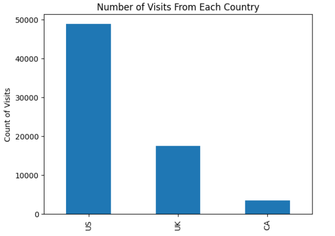
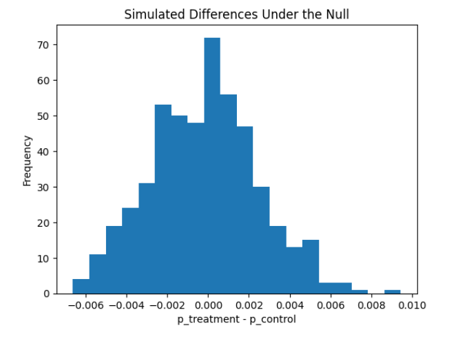

# Analyze A/B Test Results

## Project Overview

This project analyzes the results of an A/B test conducted by an e-commerce website. The company developed a new web page with the goal of increasing the number of users who convert, where conversion means that a user decides to pay for the company's product.

The objective of this project is to determine whether the company should:

- Implement the new treatment page.
- Keep the existing control page.
- Continue running the experiment for a longer period before making a final decision.

The analysis was completed using Python, pandas, NumPy, Matplotlib, Jupyter Notebook, and statistical simulation techniques.

---

## Business Problem

A/B testing is commonly used by companies to evaluate whether a product, website, or user experience change leads to better business outcomes.

In this case, the company wants to know whether the new web page improves the user conversion rate compared with the old page.

The main question addressed in this project is:

> Does the treatment page lead to a statistically significant increase in conversion rate compared with the control page?

---

## View Notebook

GitHub may not always render Jupyter notebooks directly. For easier viewing, this repository includes an HTML version of the notebook:

[View HTML Notebook](./analyze_ab_test_results_project.html)

You can also view the notebook using nbviewer:

[View Notebook on nbviewer](https://nbviewer.org/github/pepeluseo/analyze-ab-test-results/blob/main/analyze_ab_test_results_project.ipynb)

## Dataset Description

The dataset contains information about users who participated in the experiment.

Each row represents one user visit and includes the following columns:

| Column | Description |
|---|---|
| `country` | Country where the user is from |
| `group` | Experiment group assigned to the user: `control` or `treatment` |
| `converted` | Whether the user converted. `1` means converted, `0` means not converted |

The dataset contains:

- **69,889 rows**
- **3 columns**
- **No missing values**

---

## Project Structure

The repository is organized as follows:

```text
.
├── Analyze_ab_test_results_notebook.ipynb
├── ab_data.csv
├── presentation.pdf
├── README.md
├── .gitignore
└── screenshot/
    ├── Number_Visits.png
    └── Simulated_Differences.png
```

---

## Screenshots

The following screenshots provide a visual summary of the project outputs and final analysis.

### Number of Visits by Country



### Simulated Differences Under the Null Hypothesis



---

## Analysis Steps

The project follows a structured data analysis process.

---

### 1. Data Loading

The dataset was loaded into a pandas DataFrame using:

```python
df = pd.read_csv('ab_data.csv')
```

The first rows of the dataset were inspected to understand the available columns and values.

---

### 2. Exploratory Data Analysis

The initial exploration included:

- Checking the number of rows and columns.
- Identifying missing values.
- Reviewing data types.
- Counting users by country.
- Calculating the overall conversion rate.
- Reviewing conversion counts.

Key findings from the initial exploration:

- Total users: **69,889**
- No missing values were found.
- The `converted` column contains only binary values:
  - `0`: user did not convert.
  - `1`: user converted.

The `converted` column is numeric and binary, which makes it possible to calculate conversion rates using the mean of the column.

---

### 3. Probability Analysis

The probability analysis focused on understanding conversion rates across different groups and countries.

#### Overall Conversion Rate

The overall conversion rate was:

```text
13.05%
```

This means that approximately **13.05%** of all users in the dataset converted.

---

#### Conversion Rate by Group

| Group | Conversion Rate |
|---|---:|
| Control | 10.53% |
| Treatment | 15.53% |

The treatment group showed a higher observed conversion rate than the control group.

---

#### Difference in Conversion Rates

```text
Treatment Conversion Rate - Control Conversion Rate = 5.01 percentage points
```

This means that, in the observed dataset, users in the treatment group converted at a rate approximately **5.01 percentage points higher** than users in the control group.

Although this observed difference suggests that the treatment page may perform better, statistical testing is needed to determine whether the difference is unlikely to have occurred by random chance.

---

### 4. Country-Level Analysis

Conversion rates were also analyzed by country.

| Country | Conversion Rate |
|---|---:|
| CA | 12.53% |
| UK | 12.51% |
| US | 13.28% |

The conversion rate varies slightly between countries, with the United States showing the highest overall conversion rate.

However, the differences between countries are relatively small, so these results should be interpreted carefully.

---

### 5. Conversion Rates by Country and Group

The conversion rates were also compared across both country and experiment group.

| Group | US | UK | CA |
|---|---:|---:|---:|
| Control | 10.7% | 10.2% | 9.4% |
| Treatment | 15.8% | 14.9% | 15.4% |

The treatment group had a higher conversion rate than the control group in all three countries.

This suggests that the treatment page is associated with higher conversion rates across different countries. However, country-level differences should be interpreted carefully, and additional statistical modeling would be needed to fully evaluate possible interaction effects between country and treatment.

---

## A/B Test Simulation

The A/B test was evaluated using simulation under the null hypothesis.

The purpose of this simulation was to understand how likely it would be to observe a difference as large as the one found in the dataset if there were actually no true difference between the treatment and control pages.

---

### Null Hypothesis

The null hypothesis assumes that the new treatment page does not improve conversion compared with the old control page.

```text
H0: p_treatment <= p_control
```

In practical terms, this means the new page does not perform better than the old page.

---

### Alternative Hypothesis

The alternative hypothesis assumes that the treatment conversion rate is greater than the control conversion rate.

```text
H1: p_treatment > p_control
```

In practical terms, this means the new page improves conversion compared with the old page.

---

## Simulation Method

Under the null hypothesis, the conversion rate was assumed to be the same for both treatment and control groups.

The global conversion rate was used to simulate conversion outcomes for both groups:

```python
p_control_treatment_null = df['converted'].mean()
```

The sample sizes for the treatment and control groups were taken from the original dataset:

```python
n_treatment = df.query('group == "treatment"').shape[0]
n_control = df.query('group == "control"').shape[0]
```

The sample sizes were:

| Group | Number of Users |
|---|---:|
| Treatment | 35,211 |
| Control | 34,678 |

Then, 500 simulated differences were generated:

```python
p_diffs = []

for _ in range(500):
    treatment_converted = np.random.choice(
        [0, 1],
        size=n_treatment,
        p=[1 - p_control_treatment_null, p_control_treatment_null]
    )

    control_converted = np.random.choice(
        [0, 1],
        size=n_control,
        p=[1 - p_control_treatment_null, p_control_treatment_null]
    )

    p_diff = treatment_converted.mean() - control_converted.mean()
    p_diffs.append(p_diff)

p_diffs = np.array(p_diffs)
```

These simulated values represent the distribution of expected differences if there were truly no improvement from the treatment page.

---

## Histogram of Simulated Differences

The simulated differences were plotted in a histogram to visualize the distribution under the null hypothesis.

The distribution was expected to be centered around zero because, under the null hypothesis, there is no real difference between the treatment and control conversion rates.

```python
plt.hist(p_diffs, bins=20)
plt.xlabel('p_treatment - p_control')
plt.ylabel('Frequency')
plt.title('Simulated Differences Under the Null')
plt.show()
```

The histogram helps compare the observed difference against the range of differences expected by random chance under the null hypothesis.

---

## P-Value

The observed difference between treatment and control conversion rates was:

```text
0.0501
```

or approximately:

```text
5.01 percentage points
```

The p-value was calculated as the proportion of simulated differences greater than the observed difference:

```python
obs_diff = df.query('group == "treatment"')['converted'].mean() - df.query('group == "control"')['converted'].mean()

(p_diffs > obs_diff).mean()
```

The simulated p-value was approximately:

```text
0.000
```

---

## Interpretation of Results

The p-value represents the probability of observing a difference as large as the one found in the dataset if the null hypothesis were true.

Since the p-value is approximately **0.000**, and this is lower than the Type I error threshold of **0.05**, the result is statistically significant.

Therefore, the null hypothesis is rejected.

This means there is statistically significant evidence that the treatment page has a higher conversion rate than the control page.

---

## Final Recommendation

Based on the analysis, the treatment page achieved a higher conversion rate than the control page.

The treatment conversion rate was:

```text
15.53%
```

The control conversion rate was:

```text
10.53%
```

The observed improvement was:

```text
5.01 percentage points
```

The p-value was approximately:

```text
0.000
```

Because the p-value is below the significance level of **0.05**, there is statistically significant evidence that the new treatment page improves conversions.

---

### Recommendation

The company should consider implementing the new treatment page, as the analysis provides strong statistical evidence that it performs better than the old control page.

However, before full deployment, the company may also consider reviewing practical business factors such as:

- Implementation cost.
- User experience impact.
- Long-term conversion behavior.
- Technical feasibility.
- Potential differences across customer segments.
- Whether the observed improvement remains stable over time.

---

## Key Results Summary

| Metric | Value |
|---|---:|
| Total users | 69,889 |
| Treatment visitors | 35,211 |
| Control visitors | 34,678 |
| Overall conversion rate | 13.05% |
| Treatment conversion rate | 15.53% |
| Control conversion rate | 10.53% |
| Difference in conversion rates | 5.01 percentage points |
| P-value | Approximately 0.000 |
| Significance level | 0.05 |
| Decision | Reject the null hypothesis |
| Recommendation | Implement the treatment page |

---

## Technologies Used

This project was completed using:

- Python
- pandas
- NumPy
- Matplotlib
- Jupyter Notebook
- Statistical simulation
- A/B testing methodology

---

## Files Included

| File / Folder | Description |
|---|---|
| `Analyze_ab_test_results_notebook.ipynb` | Main Jupyter Notebook containing the full analysis |
| `ab_data.csv` | Dataset used for the A/B test analysis |
| `presentation.pdf` | Final presentation summarizing the analysis and results |
| `screenshot/` | Folder containing project screenshots |
| `README.md` | Project documentation |
| `.gitignore` | Git ignore file for unnecessary local files |

---

## How to Run the Project

To run this project locally, follow these steps.

### 1. Clone the repository

```bash
git clone https://github.com/YOUR_USERNAME/analyze-ab-test-results.git
```

### 2. Navigate into the project folder

```bash
cd analyze-ab-test-results
```

### 3. Open the project in VS Code

```bash
code .
```

### 4. Install the required Python libraries

If needed, install the main dependencies:

```bash
pip install pandas numpy matplotlib notebook
```

If the notebook includes statistical modeling, install:

```bash
pip install statsmodels
```

### 5. Launch Jupyter Notebook

```bash
jupyter notebook
```

Then open:

```text
Analyze_ab_test_results_notebook.ipynb
```

Run the notebook cells from top to bottom.

---

## Requirements

The project requires the following Python libraries:

```text
pandas
numpy
matplotlib
jupyter
```

Optional, depending on the notebook version:

```text
statsmodels
```

---

## Example Code Snippets

### Loading the Dataset

```python
import pandas as pd
import numpy as np
import matplotlib.pyplot as plt

df = pd.read_csv('ab_data.csv')
df.head()
```

### Checking Dataset Shape

```python
df.shape
```

Expected output:

```text
(69889, 3)
```

### Checking Missing Values

```python
df.isnull().sum()
```

Expected output:

```text
country      0
group        0
converted    0
dtype: int64
```

### Calculating Overall Conversion Rate

```python
df['converted'].mean()
```

Expected result:

```text
0.13047832992316388
```

### Calculating Group Conversion Rates

```python
df.groupby('group')['converted'].mean()
```

Expected results:

```text
control      0.105254
treatment    0.155321
```

### Calculating Country Conversion Rates

```python
df.groupby('country')['converted'].mean()
```

Expected results:

```text
country
CA    0.125287
UK    0.125121
US    0.132774
Name: converted, dtype: float64
```

### Calculating Conversion Rates by Country and Group

```python
df.groupby(['group', 'country'])['converted'].mean().unstack()
```

Expected results:

```text
country          CA        UK        US
group                                  
control    0.094...  0.102...  0.107...
treatment  0.154...  0.149...  0.158...
```

---

## Lessons Learned

This project demonstrates how A/B testing can be used to support data-driven product decisions.

Key learnings include:

- How to calculate conversion rates.
- How to compare treatment and control groups.
- How to analyze conversion rates by country.
- How to simulate outcomes under a null hypothesis.
- How to calculate and interpret a p-value.
- How to connect statistical reasoning with practical business recommendations.
- How to communicate results through a presentation for stakeholders.

---

## Limitations

Although the results show strong statistical evidence in favor of the treatment page, there are still some practical considerations:

- The analysis focuses on conversion rate only.
- The dataset does not include long-term user behavior.
- The analysis does not include revenue per user or customer lifetime value.
- The dataset includes only three countries.
- Business and technical implementation costs were not included.
- Additional testing may be useful to validate whether the effect remains stable over time.

---

## Final Conclusion

The treatment page achieved a higher conversion rate than the control page.

The observed difference was approximately **5.01 percentage points**, and the simulated p-value was approximately **0.000**, which is below the significance threshold of **0.05**.

Therefore, the null hypothesis was rejected.

The analysis provides statistically significant evidence that the new treatment page improves conversion compared with the old control page.

Based on these findings, the company should consider implementing the treatment page.

---

## Author

**Jose Luis Lazaro Contreras**

System Developer Associate  
QA / Data Analytics / Python Projects

---

## Acknowledgments

This project was completed as part of the Udacity Data Analyst / Data Science learning path.

The project scenario, starter notebook, dataset, and presentation template were provided by Udacity for educational purposes.
